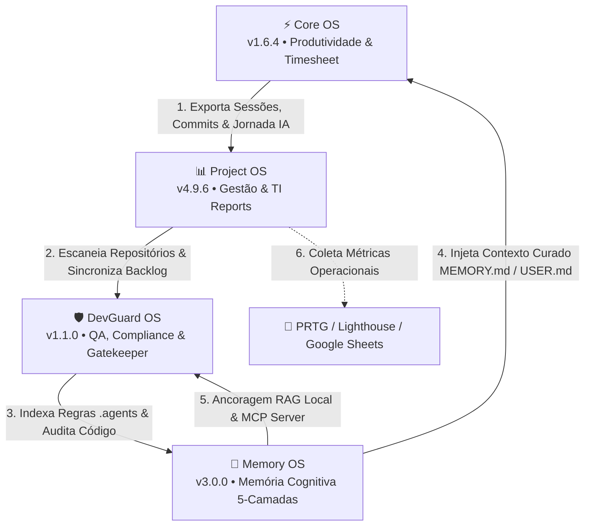

# 🌐 OS SYSTEM — Autonomous Software Engineering & Governance Ecosystem

> **Ecossistema autônomo de Engenharia de Software, Governança Técnica, Gestão Executiva e Memória Cognitiva para Agentes de IA.**

---

## 📋 Visão Geral Executiva

A **OS SYSTEM** é uma infraestrutura de software de alta performance projetada para eliminar a fragmentação de contexto em equipes técnicas e executivas. O ecossistema une **Inteligência Artificial Autônoma (RAG & Multi-IDE)**, **Governança de Código Local & Compliance**, **Gestão Executiva de Projetos (PMBOK/Agile & TI Reports)** e **Produtividade & Timesheet Inteligente**.

Em ambientes modernos de desenvolvimento, desenvolvedores e gerentes enfrentam perda contínua de contexto trocando entre ferramentas de comunicação (Gmail, Slack, WhatsApp), sistemas de tarefas (Google Tasks, Kanban, Gantt), ferramentas de QA/Git e plataformas de IA desvinculadas da memória do projeto. A **OS SYSTEM** conecta de forma fluida todas as etapas da engenharia de software — da rotina diária ao fechamento de SLAs e auditorias de código — garantindo que os agentes de IA operem sem alucinação, ancorados na memória viva dos repositórios.

---

## 🏛️ Diagrama Arquitetural e Fluxo de Integração



---

## 📦 Repositórios Mestre do Ecossistema

---

### 🧠 1. Memory OS — *Cognitive Memory Infrastructure & Multi-IDE Orchestration for AI Agents*
* **Repositório:** [`MemoryOS`](https://github.com/ProjectOS-system/MemoryOS) | **Versão:** `v3.0.0 (v2.1.0-homolog)`
* **Propósito:** Sistema de memória cognitiva cumulativa e contínua de loop duplo que emula a neurociência humana em software. Fornece aos agentes de IA (no **Google Antigravity** e **Cursor IDE**) preservação de contexto contínuo, aprendizado de preferências e evolução sem contaminação ou estouro de contexto.

#### 🔬 Arquitetura Cognitiva em 5 Camadas (Neurociência em Código):
1. **Memória de Trabalho (Working Memory - Córtex Pré-Frontal):** Contexto ativo do chat com *Pre-Compress Insight Extraction* antes da sumarização/descarte de tokens.
2. **Memória Episódica (Subconsciente - Hipocampo):** Repositório passivo append-only em SQLite (`brain.db`) com busca **FTS5 (Full-Text Search)** e motor de Relevância por Tríade (Park et al. - Stanford):
   $$\text{FinalScore} = \text{BM25} \cdot \left( \frac{1}{1 + 0.05 \cdot \text{dias}} \right) \cdot \text{ImportanceScore}$$
3. **Memória Semântica (Neocórtex / Sono REM):** Conhecimento perene destilado em `USER.md` e `MEMORY.md`. Inclui log bi-temporal `fact_history` (Graphiti/Mem0), *Write Approval Gate* (`pending_writes`), *Drift Detection* (SHA-256) e *Threat Pattern Scanning* (Prompt Injection).
4. **Memória Ambiental (Memória Implícita):** Injeção de contexto via `.agents/PROJECT_MEMORY.md` na raiz de cada repositório alvo.
5. **Memória Procedimental (Cerebelo & Gânglios Basais):** Tabela `procedural_skills` exportada para `SKILLS.md` e exposta via **Servidor MCP Nativo (`mcp_server.js`)** em protocolo stdio JSON-RPC.

#### ✨ Principais Diferenciais e Funcionalidades:
* **Orquestração Multi-IDE:** Alternância fluida e configuração automática para Antigravity e Cursor.
* **Write Approval Gate & Staging:** Interface `PendingWritesManager.jsx` para aprovação humana de memórias com nível de confiança $<85\%$.
* **21 Checks de Autodiagnóstico (`/api/diagnostics`):** Diagnóstico profundo de saúde (banco, FTS5, tamanhos, WAL mode, drift, cron, hooks) com tooltips explicativos e autocorreção em 1-clique.
* **Cascata Resiliente de IA:** Suporte a múltiplas API Keys Gemini e fallback automático entre modelos (`gemini-3.6-flash` $\rightarrow$ `gemini-3.1-pro-preview` $\rightarrow$ `gemini-2.5-flash` $\rightarrow$ `gemini-2.5-pro` $\rightarrow$ `gemini-2.0-flash`).
* **Data Lifecycle & Catch-Up Scheduler:** Expurgo automático de mensagens $>6$ meses e rotina Anacron (`startup_scheduler.js`) para catch-up de tarefas diárias/semanais pendentes.
* **Tour Simulado Interativo:** Modal `<SimulatedTourModal />` com demonstração animada dos fluxos cognitivos da plataforma.

| Camada | Tecnologia | Porta / Contexto |
|:---|:---|:---|
| **Frontend** | React 19 + Vite | `59234` |
| **Backend Engine** | Node.js + Express 5 | `59235` |
| **Desktop Shell** | Tauri v2 Desktop Wrapper | Windows Native |
| **Database & Search** | SQLite3 com FTS5 (`brain.db` WAL mode) | `~/.gemini/antigravity/brain/` |
| **Protocolo de Agentes** | MCP Server (`mcp_server.js`) | stdio JSON-RPC |

---

### 🛡️ 2. DevGuard OS — *Autonomous Code Governance, QA & Release Gatekeeper*
* **Repositório:** [`DevGuardOS`](https://github.com/ProjectOS-system/DevGuardOS) | **Versão:** `v1.1.0-homolog`
* **Propósito:** Plataforma desktop autônoma de governança de código, auditoria contínua de segurança/arquitetura e automação de releases para repositórios de software locais.

#### ✨ Principais Diferenciais e Funcionalidades:
* **QA & Compliance Scanner v2.0:** 18+ verificações heurísticas profundas em 5 categorias ponderadas (Segurança 25-30%, Arquitetura 25-30%, Performance & DevOps 25%, Docs 15%, Frontend 10%). Autogera o relatório `AUDIT_REPORT.md` na raiz do repositório.
* **Auditoria Sensível ao Tipo de Projeto (`repoType-aware`):** Adaptação dinâmica de regras para `backend`, `frontend`, `fullstack` ou `mobile`. Repositórios backend não recebem penalidades de UI/UX e têm seus pesos redistribuídos automaticamente.
* **Análise Multi-Linguagem:** Inspeção em 16+ linguagens de programação (`.js`, `.ts`, `.java`, `.py`, `.cs`, `.go`, `.rs`, `.kt`, `.php`, etc.) e 11 manifestos de dependências (`pom.xml`, `build.gradle`, `requirements.txt`, `go.mod`, `Cargo.toml`, etc.).
* **Gatekeeper de Release `@ops`:** Módulo `docsService.js` para geração e atualização automatizada de `CHANGELOG.md` (Keep a Changelog), `README.md`, `API_REFERENCE.md` e propostas de commit semântico via IA.
* **Git Resilience (`gitService.js`):** Gestão nativa de Git com auto-rebase em push rejeitado, remoção automatizada da trava `.git/index.lock` e tratamento de quebras de linha CRLF/LF.
* **Auto-Cura (`selfHealingService.js`):** Diagnóstico e restauração em 1-clique dos 14 arquivos/diretórios da estrutura de governança `.agents/`.
* **Design System Cyber Emerald & Cyan:** Interface desktop espetacular com Tauri v2 em modo escuro nativo.

| Camada | Tecnologia | Porta / Contexto |
|:---|:---|:---|
| **Frontend** | React + Vite + Cyber Emerald UI | `59237` |
| **Backend Engine** | Node.js + Express.js | `59236` |
| **Desktop Shell** | Tauri v2 (Rust + WebView2) | App Desktop Standalone |
| **Data & Secrets** | SQLite FTS5 (`devguard_brain.db`) + JSON Secrets | `backend/data/` |

---

### 📊 3. Project OS — *Executive Project Management, AI Assistant & Technical Reporting*
* **Repositório:** [`ProjectManagementSystem`](https://github.com/ProjectOS-system/ProjectManagementSystem) | **Versão:** `v4.9.6`
* **Propósito:** Central executiva de gestão de projetos, portfólios, tarefas e relatórios técnicos formais de TI, integrando inteligência artificial generativa, metodologias ágeis e dados de infraestrutura local.

#### ✨ Principais Diferenciais e Funcionalidades:
* **Cascata Cruzada Multi-Chaves & Modelos Gemini 3.x:** Fila dinâmica de chaves de API (`gemini_api_keys`) com rotação automática em 5 níveis de modelos (`gemini-3.6-flash` $\rightarrow$ `gemini-3.1-pro-preview` $\rightarrow$ `gemini-2.5-flash` $\rightarrow$ `gemini-2.5-pro` $\rightarrow$ `gemini-2.0-flash`) em 9 áreas da aplicação, respaldada por cache MD5 no SQLite.
* **Motor de Relatórios Gerenciais de TI (`/ti-reports`):** Geração automática de documentos `.docx` e `.pdf` profissionais enriquecidos com gráficos dinâmicos Recharts (renderizados em Base64), cálculo de tempo de disponibilidade PRTG (`29d 14h 38m 0s`), notas Lighthouse e visão mensal ou semestral (S1/S2).
* **Sincronização Bilateral Planilha TI (Google Sheets / Notion Dashboard):** Exportação com fusão seletiva (*Selective Merge*) das abas `PDCA`, `PROJETOS` e `Relatorios de Disponibilidade`, mantendo o histórico de meses anteriores e os estilos visuais originais.
* **Assistente de IA FAB v4.0 (`Ctrl+Shift+A`):** Chat flutuante contextual com memória operacional para criação de projetos/tarefas em linguagem natural, com *Human-in-the-loop* (preview de aprovação) e Personas de IA (Agile Coach, Diretor Criativo).
* **Gestão Multivisual & Portfólios v4.5:** Quadros Kanban, Listas (Inline Edit `InlineDataTable`), Calendário e **Gantt Chart Interativo v3.3** (setas de dependência SVG, auto-cálculo de datas, ordenação por colunas e exportação PNG/PDF). Suporte nativo a Hierarquia Portfólio $\rightarrow$ Subprojetos.
* **Sincronizador de Ecossistema (`/sync`):** Leitura direta e unificação dos apontamentos de horas do Core OS (`coreos.db`) e das memórias técnicas do Memory OS (`PROJECT_MEMORY.md`).

| Camada | Tecnologia | Porta / Contexto |
|:---|:---|:---|
| **Frontend** | React 19 + Vite 5 + Recharts | `59238` |
| **Backend Engine** | Node.js + Express API | Local Service (`CREATE_NO_WINDOW`) |
| **Desktop Shell** | Tauri v2 + WebView2 (~5MB / ~40MB RAM) | Porta Isolada `59238` |
| **Banco de Dados** | SQLite (`better-sqlite3`) | `backend/data/projectos.db` |

---

### ⚡ 4. Core OS — *Unified Productivity, Workspace & Intelligent Timesheet*
* **Repositório:** [`CoreOS`](https://github.com/ProjectOS-system/CoreOS) | **Versão:** `v1.6.4`
* **Propósito:** Central de produtividade diária que unifica os canais de comunicação do desenvolvedor, tarefas, links rápidos e rastreamento inteligente de jornada de trabalho assistido por IA.

#### ✨ Principais Diferenciais e Funcionalidades:
* **Inbox Unificado de Email (Gmail):** Suporte multi-conta estilo Mailbird, rastreamento de emails por pixel de abertura e links clicados, com notificações em tempo real via WebSocket.
* **Google Calendar & Google Tasks Integrados:** Visão completa de calendário com expansão de eventos multi-dias no formato `(dia n/N)` e Kanban/Lista de tarefas com status customizados, drag-and-drop e sincronização resiliente (*self-healing* por e-mail).
* **Drawers Laterais Opera-Style:** Painéis laterais com persistência de sessão para WhatsApp, Slack, Notion, PRTG e Websites Customizados (com mute de áudio individual, detecção de badges por DOM/título e dark mode injetado).
* **Timesheet Inteligente & Jornada IA:** Cálculo automático de horas trabalhadas por projeto, sincronização nativa com commits do Git (`ts_commits`) e correlação com o histórico de conversas com IA no `brain.db` do Memory OS (528+ conversas analisadas por 4 métodos de scoring).
* **Exportação Rica de Dados:** Geração de relatórios CSV/MD contendo mensagens de commits, tarefas vinculadas e transcrições sintetizadas da IA.
* **Desktop App Standalone:** Executável Tauri v2 sem necessidade de firewall (escrita em `127.0.0.1`), com suporte a atalhos do Gmail (`C`, `R`, `E`, `Z`, `Ctrl+K`).

| Camada | Tecnologia | Porta / Contexto |
|:---|:---|:---|
| **Frontend** | React 19 + Vite 5 | `31338` (Dev / Local) |
| **Backend Server** | Express.js 5 + WebSockets (`ws`) | `http://localhost:31338` |
| **Desktop Shell** | Tauri v2 + WebView2 | `%LOCALAPPDATA%\CoreOS\` |
| **Database** | SQLite (`better-sqlite3`) | `coreos.db` |

---

## 🔗 Matriz de Interoperabilidade do Ecossistema

```
+------------------+         (Sessões & Commits)          +------------------+
|     Core OS      | -----------------------------------> |    Project OS    |
| (Timesheet & Work) |                                    | (Gestão & Reports)|
+------------------+                                      +------------------+
         |                                                         |
         | (Histórico IA)                                          | (Mapeia Repos)
         v                                                         v
+------------------+         (Governança & Memory)        +------------------+
|    Memory OS     | <----------------------------------- |   DevGuard OS    |
| (Memória IA 5L)  |                                    | (QA & Compliance)|
+------------------+                                      +------------------+
```

1. **Core OS $\rightarrow$ Project OS:** O Project OS lê as tabelas `ts_sessions` e `ts_commits` do `coreos.db` para consolidar automaticamente as horas investidas em cada projeto e converter sessões em tarefas concluídas.
2. **Project OS $\rightarrow$ DevGuard OS:** O Project OS identifica a estrutura de repositórios locais vinculados aos projetos e aciona o DevGuard OS para auditoria de QA e geração de `AUDIT_REPORT.md`.
3. **DevGuard OS $\rightarrow$ Memory OS:** O DevGuard OS garante que a matriz `.agents/` e os arquivos `PROJECT_MEMORY.md` de cada repositório estejam em conformidade com as regras globais indexadas pelo Memory OS.
4. **Memory OS $\rightarrow$ Ecossistema:** O Memory OS fornece o contexto curado (`MEMORY.md`, `USER.md`, FTS5 e Servidor MCP) para que os agentes de IA operando no Core OS, Project OS e DevGuard OS atuem com precisão cirúrgica sem alucinações.

---

## 🛠️ Stack Tecnológica Consolidada do Ecossistema

| Domínio | Tecnologias Utilizadas |
|:---|:---|
| **Interface & Desktop** | React 19, Vite 5, CSS Vanilla / Tokens HSL, Tauri v2 (Rust + WebView2 Nativo) |
| **Backend Engine** | Node.js (v20+), Express 5, WebSockets (`ws`), REST APIs, Passport.js (Google OAuth 2.0) |
| **Armazenamento & RAG** | SQLite3 (`better-sqlite3`), SQLite FTS5 (Full-Text Search), WAL Mode, JSON Secrets |
| **Inteligência Artificial** | Google Gemini API (Cascata Resiliente: `gemini-3.6-flash` $\rightarrow$ `gemini-3.1-pro-preview` $\rightarrow$ `gemini-2.5-flash` $\rightarrow$ `gemini-2.5-pro` $\rightarrow$ `gemini-2.0-flash`), Cache MD5, Servidor MCP Nativo |
| **Arquitetura de Agentes** | Matriz de Governança `.agents/` (`rules/`, `skills/`, `workflows/`, `PROJECT_MEMORY.md`), Stanford Triad Ranking |

---

## 🔒 Princípios de Engenharia & Governança OS SYSTEM

1. **Local-First & Privacidade Estrita:** Todo o conhecimento de negócios, históricos de chat e credenciais permanecem indexados e criptografados no ambiente local via SQLite FTS5.
2. **Resiliência por Cascata de IA:** Nenhuma operação é interrompida por erros de cota (HTTP 429) ou indisponibilidade (HTTP 503) através do fallback dinâmico entre chaves e modelos da família Gemini 3.x/2.x.
3. **Governança como Código:** Diretrizes arquiteturais, padrões de UI/UX e protocolos operacionais são versionados nos repositórios sob a pasta `.agents/`.
4. **Alinhamento Bi-Temporal e Antialucinação:** O conhecimento do sistema possui controle de validade temporal e verificações de integridade SHA-256 para evitar mutações e alucinações de IA.

---

## 🚦 Mapeamento de Portas e Serviços Locais

| Aplicação | Serviço | Porta Padrão | Protocolo |
|:---|:---|:---:|:---:|
| **Core OS** | API & Web Frontend | `31338` | HTTP / WS |
| **Project OS** | App & Server Dedicated | `59238` | HTTP |
| **DevGuard OS** | Backend Engine | `59236` | HTTP |
| **DevGuard OS** | Desktop Frontend | `59237` | HTTP |
| **Memory OS** | Frontend UI | `59234` | HTTP |
| **Memory OS** | Backend Server & RAG | `59235` | HTTP / SSE / MCP stdio |

---

<p align="center">
  <sub>OS SYSTEM — Empowering Software Engineering with Autonomous AI & Governance by Caio Gonçalves</sub>
</p>
