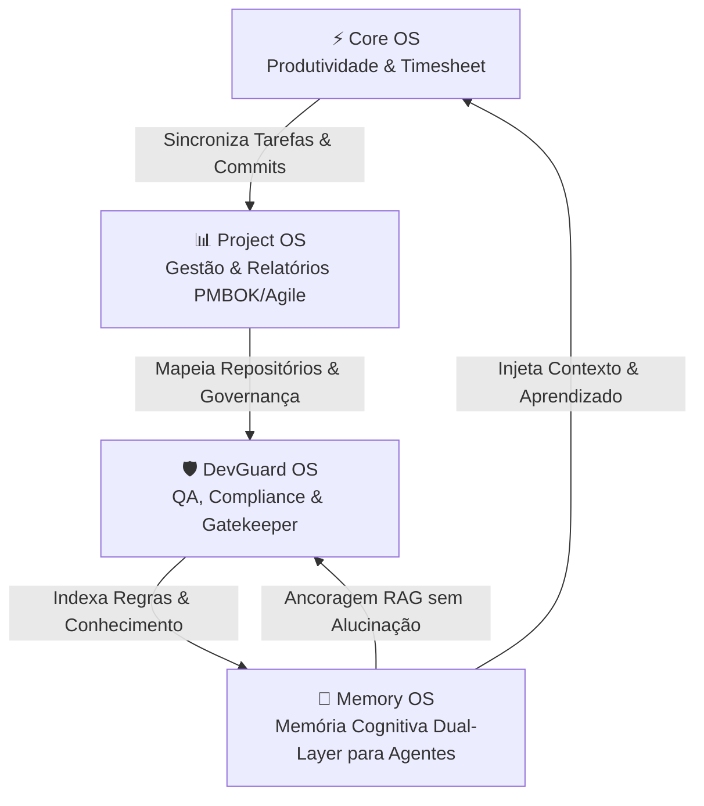

# 🌐 VTI OS SYSTEM — Autonomous Software Engineering & Governance Ecosystem

> **Ecossistema autônomo de Engenharia de Software, Governança Técnica, Gestão Executiva e Memória Cognitiva para Agentes de IA.**

---

## 📋 Visão Geral

A **VTI OS SYSTEM** é uma organização pioneira no desenvolvimento de uma infraestrutura integrada de software, desenhada para unir **Inteligência Artificial Autônoma**, **Governança de Código Local**, **Gestão Executiva de Projetos** e **Produtividade Unificada**.

Nosso ecossistema resolve a fragmentação de contexto em equipes técnicas e executivas. Conectamos todas as pontas da engenharia de software — da captura diária de trabalho à prestação de contas com métricas de infraestrutura, mantendo os agentes de IA estritamente alinhados com as regras e memória dos projetos.

---

## 🏛️ Diagrama do Ecossistema

---

## 📦 Repositórios Mestre do Ecossistema

### 🧠 1. Memory OS — *Cognitive Memory Infrastructure for AI Agents*
* **Repositório:** [`MemoryOS`](https://github.com/ProjectOS-system/MemoryOS)
* **Propósito:** Sistema de memória cumulativa e contínua de loop duplo projetado para emular o modelo neurocientífico de cognição humana em software.
* **Diferenciais:**
  * **Arquitetura 4-Layer:** Memória de Trabalho (Chat), Episódica (`brain.db` SQLite FTS5), Semântica (`MEMORY.md` / `USER.md`) e Ambiental (`PROJECT_MEMORY.md`).
  * **Zero Alucinação & Drift Protection:** Monitoramento via hashes SHA-256 e varredura em tempo real contra *Prompt Injection*.
  * **Resiliência de IA:** Engine de cascata inteligente com modelos Gemini 3.x e 2.x com tolerância automática para erros 429 e 503.
* **Stack:** React 19, Vite, Express 5, Node.js, SQLite3 FTS5, Tauri v2.

---

### 🛡️ 2. DevGuard OS — *Autonomous Code Governance, QA & Release Gatekeeper*
* **Repositório:** [`DevGuardOS`](https://github.com/ProjectOS-system/DevGuardOS)
* **Propósito:** Plataforma desktop autônoma que injeta governança técnica, auditoria contínua de código e automação de releases nos repositórios locais da equipe.
* **Diferenciais:**
  * **Scanner QA & Compliance v2.0:** 18+ verificações heurísticas locais (Segurança, Arquitetura, DevOps, Frontend e Docs) ajustadas dinamicamente pelo tipo de repositório (`backend`, `frontend`, `fullstack`).
  * **Gatekeeper de Releases `@ops`:** Leitura de `git diff` para geração automatizada de `CHANGELOG.md` (Keep a Changelog), `README.md`, `API_REFERENCE.md` e propostas de commit semântico.
  * **Auto-Cura (`selfHealingService`):** Diagnóstico e restauração em 1-clique da estrutura de governança `.agents/`.
* **Stack:** Node.js, Express, SQLite FTS5, Tauri v2 Desktop, Cyber Emerald & Cyan UI.

---

### 📊 3. Project OS — *Executive Project Management & Automated Technical Reporting*
* **Repositório:** [`ProjectManagementSystem`](https://github.com/ProjectOS-system/ProjectManagementSystem)
* **Propósito:** Central executiva de gestão de portfólios, projetos e tarefas alinhada com os padrões PMBOK e metodologias ágeis (Scrum/Kanban).
* **Diferenciais:**
  * **Gerador de Relatórios Executivos:** Geração de documentos `.docx` e `.pdf` profissionais enriquecidos com IA e dados consolidados.
  * **Integrações de Infraestrutura:** Coleta em tempo real de métricas do PRTG (SLA de sensores) e Google PageSpeed Insights (Lighthouse).
  * **Sincronização Bilateral:** Conexão nativa com Dashboards do Notion, Obsidian Vaults e Google Sheets.
* **Stack:** React 19, Node.js, Express, `better-sqlite3`, Google Gemini API, `docx` / `docxtemplater`.

---

### ⚡ 4. Core OS — *Unified Productivity, Workspace & Intelligent Timesheet*
* **Repositório:** [`CoreOS`](https://github.com/ProjectOS-system/CoreOS)
* **Propósito:** Central de produtividade diária que unifica ferramentas de comunicação, gestão de tarefas e rastreamento de jornada do desenvolvedor.
* **Diferenciais:**
  * **Agregação de Workspaces:** Centralização de Gmail multi-conta, Google Calendar, WhatsApp, Slack, Notion e Google Tasks (Kanban/Lista).
  * **Timesheet Inteligente:** Rastreamento de horas com captura automática de commits Git e resumo da jornada assistido por IA.
  * **Nativização Desktop:** Instalação standalone ultra-leve sobre `Tauri v2` com WebViews persistentes de baixa latência.
* **Stack:** React 19, Vite, Express 5, SQLite3 (`better-sqlite3`), Google OAuth 2.0 (Passport.js), WebSockets, Tauri v2.

---

## 🛠️ Stack Tecnológica Consolidada

| Domínio | Tecnologias Principais |
|:---|:---|
| **Interface & Desktop** | React 19, Vite 5, CSS Vanilla / Tokens HSL, Tauri v2 (Rust + WebView2) |
| **Backend & Engine** | Node.js (v20+), Express 5, APIs REST, WebSockets, Google OAuth 2.0 |
| **Bancos de Dados & RAG** | SQLite3 (`better-sqlite3`), FTS5 Full-Text Search, Markdown Context Files |
| **Inteligência Artificial** | Google Gemini API (Cascata de Fallback: `gemini-3.6-flash` ➔ `gemini-3.1-pro-preview` ➔ `gemini-2.5-flash`), RAG Local Ancorado |
| **Arquitetura de Agentes** | Matriz de Governança `.agents/` (`rules/`, `skills/`, `workflows/`, `PROJECT_MEMORY.md`) |

---

## 🔒 Princípios de Engenharia OS SYSTEM

1. **Local-First & Privacidade:** O conhecimento técnico e dados sensíveis permanecem indexados localmente via SQLite FTS5.
2. **Resiliência por Cascata de IA:** Zero parada por estresse de cota (429) ou instabilidade (503) através do roteamento automático entre modelos Gemini 3.x/2.x.
3. **Governança como Código:** Regras de desenvolvimento, UX/UI e operações são versionadas nos repositórios através da infraestrutura `.agents/`.
4. **Interoperabilidade Nativa:** Comunicação fluida e sem atrito entre o timesheet do desenvolvedor (Core OS), a gestão de projetos (Project OS), o guardião de código (DevGuard OS) e a memória de IA (Memory OS).

---

  VTI OS SYSTEM — Empowering Software Engineering with Autonomous AI & Governance
  by Caio Gonçalves

